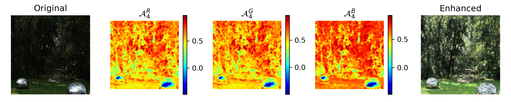
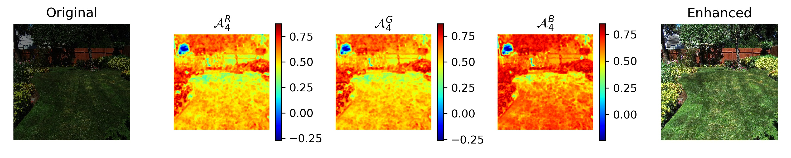
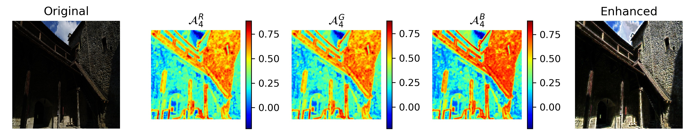

# Pytorch implementation of ZeroDCE

Link to the paper: [Zero-Reference Deep Curve Estimation for Low-Light Image Enhancement](https://arxiv.org/abs/2001.06826)


## Inference with pre-trained model

I provide a pytorch model checkpoint that I trained, to use it:

```bash
# go to the code directory
cd code/

# device=-1 => CPU, device=1 => cuda:1
python demo.py --device=-1 --testDir=../data/part1-512/test-toy \
               --ckpt=../train-jobs/ckpt/4LE-0_best_model.pth \
               --output-dir=../demo-output
```

This will process the images in `../data/part1-512/test-toy ` and save results to  `../demo-output`. Demo results including output from ZeroDCE, and simple gamma corrections for comparison.  


#### Results

Please refer to `ZeroDCE_demo_output.pdf ` and `demo-output/` for more results.










## Training

Please note in order to use this repo, **Python>=3.6 is required** since I used f-strings.


### Dataset

**ZeroDCE is trained by SICE dataset, which can be downloaded [here](https://github.com/csjcai/SICE)** 

You can prepare the dataset for training with my code by modifying the paths in `code/dataset.py` to point to where you want to put the data. 

Here is the directory structure of the dataset I'm using, `part1-512` is the root directory where I store data.

```bash
$ tree part1-512 --filelimit=10

part1-512
├── test-toy
│   ├── 318_3.JPG
│   ├── 332_1.JPG
│   ├── 340_1.JPG
│   ├── 345_1.JPG
│   ├── 353_3.JPG
│   └── 356_7.JPG
├── train [2421 entries exceeds filelimit, not opening dir]
└── val [600 entries exceeds filelimit, not opening dir]
```


### Training and evaluation

I use relative path throughout my code, so please follow the exact directories structure as shown [File Structure](#file-structure) section.

Hyper-parameters are passed through command line and a dictionary named `hp` in `train.py`, for example:

```bash
# go to the code directory
cd code/

# --experiment specify the PREFIX to use when storing outputs.
# Note in train.py, STDOUT is directed to ../train-jobs/log/<PREFIX>.log, so if program raises errors, you need to find it there. 
nohup python train.py --device=0 --baseDir=../data/part1-512 \
  --experiment=<PREFIX> --n_LE=4 --numEpoch=180 \
  --weights 2 5 2 1 &

python eval.py --device=0 --testDir=../data/part1-512/test-toy \
  --ckpt=../train-jobs/ckpt/<PREFIX>_ckpt.pth
```

Arguments are explained in `--help`, e.g., to get help for `train.py`, run `python train.py --help`.


### File Structure

You need to follow this directory structure as I use **relative** paths. Upon root directory, you need to create

*  a `code/` directory and put python files in it
* a `data/` directory and put subdirectory and data in it, considering modify `dataset.py` to your needs
* empty directories `train-jobs/log`,  `train-jobs/ckpt`, `train-jobs/evaluation` as log/checkpoing/results will be saved to them


