# Pytorch implementation of ZeroDCE

Link to the paper: [Zero-Reference Deep Curve Estimation for Low-Light Image Enhancement](https://arxiv.org/abs/2001.06826)

I do have some observations and implementation details that differ from the paper, can be found in [Implementation Details](#implementation-details)


## Inference with pre-trained model

I provide a pytorch model checkpoint that I trained, to use it:

```bash
# go to the code directory
cd code/

# device=-1 => CPU, device=1 => cuda:1
# --testDir specify where the test images are stored
python demo.py --device=-1 --testDir=../data/part1-512/test-toy \
               --ckpt=../train-jobs/ckpt/5LE-300_best_model.pth \
               --output-dir=../demo-output 
```

This will process the images in `../data/part1-512/test-toy ` and save results to  `../demo-output`. Demo results including output from ZeroDCE, and traditional gamma corrections for comparison.  


#### Results

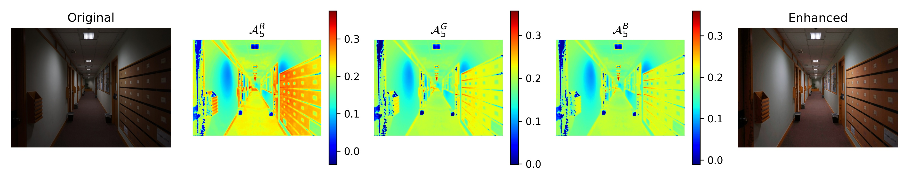

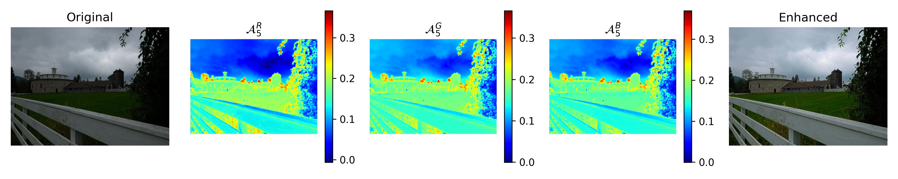

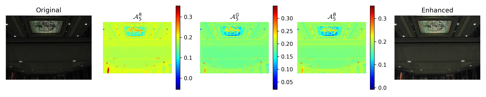

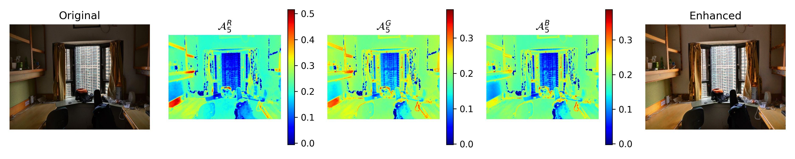

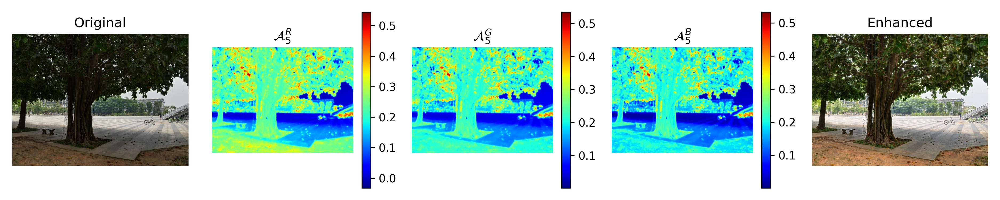

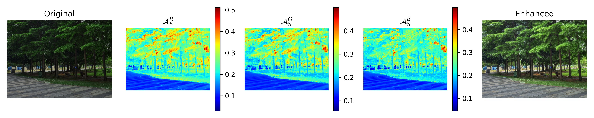

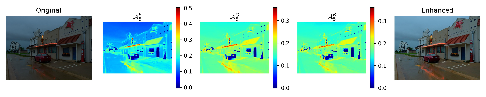

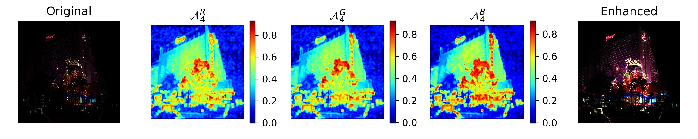

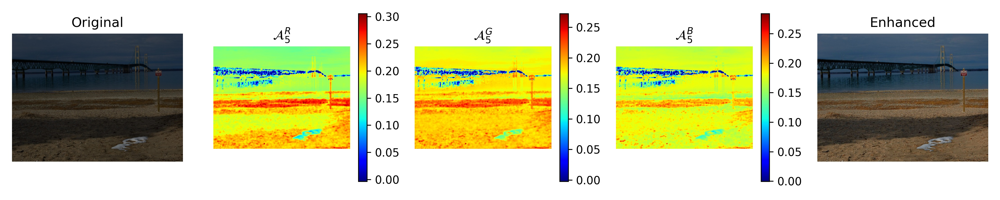

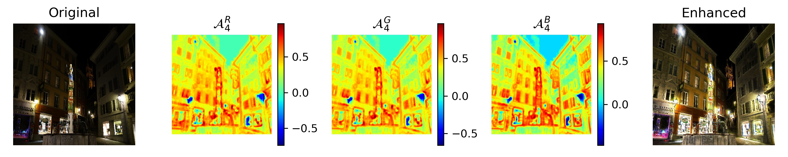


#### Comparison with traditional gamma correction

Please refer to `5LE-300_cmp.pdf` in `demo-output/` for comparison of ZeroDCE and traditional gamma corrections. The demo shown in the `pdf` here is with light enhancement LE=5, and training 300 epoches. 

120~180 epochs are enough and give better results. Results saved per 30 epochs can be found in individual folder under  `demo-output/` as well. 


## Training

Please note in order to use this repo, **Python>=3.6 is required** since I used f-strings.


### Dataset

**ZeroDCE is trained by SICE dataset, which can be downloaded [here](https://github.com/csjcai/SICE)**.

You can prepare the dataset for training with my code by modifying the paths in `code/dataset.py` to point to where you want to put the data. 

Here is how the directory structure of the data should be in order to run my code. `part1-512` is the root directory where I stored data.

```bash
$ tree part1-512 --filelimit=10

part1-512
├── test-toy
│   ├── 318_3.JPG
│   ├── 332_1.JPG
│   ├── 340_1.JPG
│   ├── 345_1.JPG
│   ├── 353_3.JPG
│   └── 356_7.JPG
├── train [2421 entries exceeds filelimit, not opening dir]
└── val [600 entries exceeds filelimit, not opening dir]
```


### Training and evaluation

I use relative path throughout my code, so please follow the exact directories structure as shown [File Structure](#file-structure) section.

Hyper-parameters are passed through command line and a dictionary named `hp` in `train.py`, for example:

```bash
# go to the code directory
cd code/


# Note in train.py, STDOUT is directed to ../train-jobs/log/<PREFIX>.log, so if program raises errors, you need to find it there. 

# --experiment specify the prefix to use when storing outputs.
python train.py --device=1 --numEpoch=300 --experiment=<@OUTPUT-PREFIX> --n_LE=5 \
   --baseDir=../data/part1-512 --testDir=../data/test-1200-900 \
   --weights 8 4 2.2 2 &

# train.py will call the evaluaton (eval.py) and store results to ../train-jobs/evaluation/ per 30 epoch.
```

To get detailed help on arguments, simply run `python train.py --help` or refers to the source code. Don't be afraid, they should be well-written and pythonic (suggestions are welcomed 👾). 


### File Structure

You need to follow this directory structure as I use **relative** paths. Upon root directory, you need to create

*  a `code/` directory and put python files in it
* a `data/` directory and put subdirectory and data in it, considering modify `dataset.py` to your needs
* empty directories `train-jobs/log`,  `train-jobs/ckpt`, `train-jobs/evaluation` as log/checkpoing/results will be saved to them

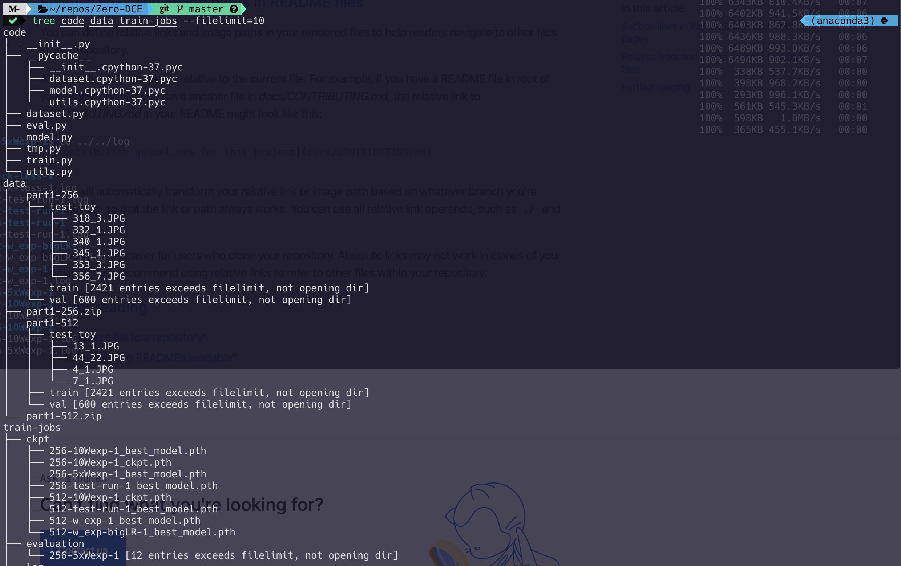


### Implementation Details

Here are my implementation details that differ from the paper

1. Since the model is small and computation is not a problem, I divised _per-pixel_ color constancy loss to substitute the color constancy loss as described in the paper, which demands the _average_ color does not shift too much. Implementations can be found in `code/utils.py`.

2. The paper claim the parameter E in exposure loss, being in range [0.4, 0.7] does not post significant difference on the model. **However, per my test E=0.7 works for this [SICE dataset](#dataset), all other E alwalys result in sub-optimal resutls.** For example when E < 0.6, instead of **increasing** the darken pixel values, the model will **decrease** the pixels values which is more saturated (like white colored area and too bright area), resulting severe artifect in white objects and the border between dark and bright obejcts. 

3. My multiplier for Spatial Constancy Loss,  Exposure Loss, Color Constancy Loss, and Total Variation Loss are 8 4 2.2 2 respectively, this differ from the paper because the loss function implementation can be the same but off by a constant(for example, taking sum or taking mean, the loss are systematically the same but the magnitude are different), 

4. Actually, I do find the number of light enhancement iterations do not matter too much. The results of LE=4, 5, 6, 7, 8 **looks** equivalent well to me (no quantitative comparison being made). 

   

## License

This project is licensed under the MIT License.

[MIT](./LICENSE) &copy; bsun

