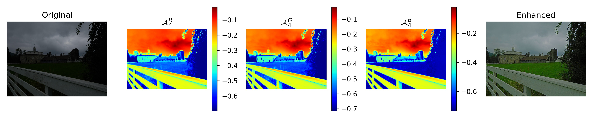

# Pytorch implementation of ZeroDCE

Link to the paper: [Zero-Reference Deep Curve Estimation for Low-Light Image Enhancement](https://arxiv.org/abs/2001.06826)


Some of my thoughts and observations during my implementatino journey of this non-reference image enhancement network can be found in [Implementation Details](#training-and-implementation-details).


This algorithm has potential for video enhancement. Here is a demo for applying vanilla ZeroDCE on a video clip without any improvements.


#### **If the video can not be displayed, see it [here](https://media.giphy.com/media/KkagL7vPeJ422010Z1/giphy.gif).**


## Inference with pre-trained model

I provide a pytorch model checkpoint that I trained, to use it:

```bash
# go to the code directory
cd code/

# --testDir specify where the test images are stored
python demo.py --device=-1 --testDir=../example-test-images/ \
               --ckpt=../train-jobs/ckpt/train-jobs/ckpt/8LE-color-loss2_best_model.pth \
               --output-dir=../demo-output 
```

This will process the images in `../example-test-images/ ` and save results to  `../demo-output`. Demo results including output from ZeroDCE, and traditional gamma corrections for comparison.  


## Results





#### Comparison with traditional gamma correction

Please refer to `comparison.pdf` in `demo-output/` for comparison of ZeroDCE and traditional gamma corrections. It shows result of  `train-jobs/ckpt/8LE-color-loss2_best_model.pth` which is the best model when trainied with 160 epochs. 

Results saved per 40 epochs can be downloaded [here](https://drive.google.com/file/d/1_kdHtW1DqhAHCTR5XkTavmDPgmuk3sOI/view?usp=sharing).

Generally, I think ~100 epochs should be good. 


## Training

Please note in order to use this repo, **Python>=3.6 is required** since I used f-strings.


### Dataset

**ZeroDCE is trained by SICE dataset, which can be downloaded [here](https://github.com/csjcai/SICE)**.

You can prepare the dataset for training with my code by modifying the paths in `code/dataset.py` to point to where you want to put the data. 

Here is how the directory structure of the data should be in order to run my code. `part1-512` is the root directory where I stored data.

```bash
$ tree part1-512 --filelimit=10

part1-512
├── test-toy
│   ├── 318_3.JPG
│   ├── 332_1.JPG
│   ├── 340_1.JPG
│   ├── 345_1.JPG
│   ├── 353_3.JPG
│   └── 356_7.JPG
├── train [2421 entries exceeds filelimit, not opening dir]
└── val [600 entries exceeds filelimit, not opening dir]
```


### Training and evaluation

I use relative path throughout my code, so please follow the exact directories structure as shown [File Structure](#file-structure) section.

Hyper-parameters are passed through command line and a dictionary named `hp` in `train.py`, for example:

```bash
# go to the code directory
cd code/


# --experiment specify the prefix to use when storing outputs.
python train.py --device=1 --numEpoch=120 --experiment=<@OUTPUT-PREFIX> --loss=1 \
   --baseDir=../data/part1-512 --testDir=../data/test-1200-900 \
   --weights 8 1.75 1 7 &

# Note in train.py, STDOUT is directed to ../train-jobs/log/<PREFIX>.log, so if program raises errors, you need to find it there. 

# train.py will call the evaluaton (eval.py) and store results to ../train-jobs/evaluation/ per 30 epoch.
```

To get detailed help on arguments, simply run `python train.py --help` or refers to the source code. Don't be afraid, they should all be well-written and pythonic (suggestions are appreciated 👾). 


### File Structure

You need to follow this directory structure as I use **relative** paths. Upon root directory, you need to create

*  a `code/` directory and put python files in it

* a `data/` directory and put subdirectory and data in it, considering modify `dataset.py` to your needs

* directories `train-jobs/log`,  `train-jobs/ckpt`, `train-jobs/evaluation` as log/checkpoing/results will be saved to them

  


## Training and implementation details

Here are some of my thoughts during implementation of this non-reference image enhancement work,

1. The paper claim the parameter E in exposure loss, being in range [0.4, 0.7] does not cast a significant difference on the model. **However, per my test E=0.6 works for this [SICE dataset](#dataset), all other E alwalys result in sub-optimal resutls.** For example when E < 0.6, instead of **increasing** the darken pixel values, the model will **decrease** the pixels values that are  more saturated (like white colored area and too bright area), resulting severe artifect in whitish objects and the border between dark and bright obejcts. 
2. My multiplier for Spatial Constancy Loss,  Exposure Loss, Color Constancy Loss, and Total Variation Loss are 8, 1.75, 1, 8 respectively, this differ from the paper because the loss function implementation can be the same but off by a constant. For example, taking sum or taking mean, the loss are systematically the same but the magnitude are different,


## Optimization of Original ZeroDCE

I devised a new version of ZeroDCE, which can achieve the same if not better results with 4-times of enhancement. The source code for this is under business license, if you want to know more about details. Shoot me an email bos AT usc DOT edu with subject ZeroDCE.


## License

This project is licensed under the MIT License.

[MIT](./LICENSE) &copy; bsun

